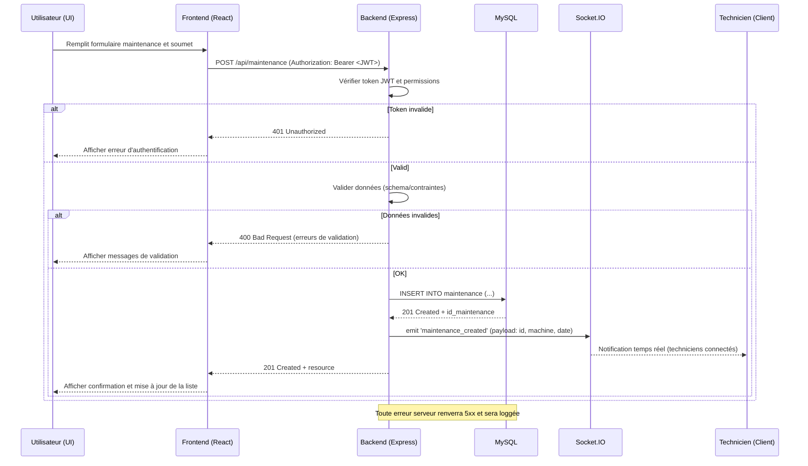

# Diagramme de séquence — Enregistrement d'une maintenance

Diagramme de séquence représentant le flux lors de la création d'un enregistrement de maintenance.

```mermaid
sequenceDiagram
    participant U as Utilisateur (UI)
    participant FE as Frontend (React)
    participant BE as Backend (Express)
    participant DB as MySQL
    participant S as Socket.IO
    participant T as Technicien (Client)

    U->>FE: Remplit formulaire maintenance et soumet
    FE->>BE: POST /api/maintenance (Authorization: Bearer <JWT>)
    BE->>BE: Vérifier token JWT et permissions
    alt Token invalide
        BE-->>FE: 401 Unauthorized
        FE-->>U: Afficher erreur d'authentification
    else Valid
        BE->>BE: Valider données (schema/contraintes)
        alt Données invalides
            BE-->>FE: 400 Bad Request (erreurs de validation)
            FE-->>U: Afficher messages de validation
        else OK
            BE->>DB: INSERT INTO maintenance (...)
            DB-->>BE: 201 Created + id_maintenance
            BE->>S: emit 'maintenance_created' (payload: id, machine, date)
            S-->>T: Notification temps réel (techniciens connectés)
            BE-->>FE: 201 Created + resource
            FE-->>U: Afficher confirmation et mise à jour de la liste
        end
    end

    Note over BE,DB: Toute erreur serveur renverra 5xx et sera loggée
```