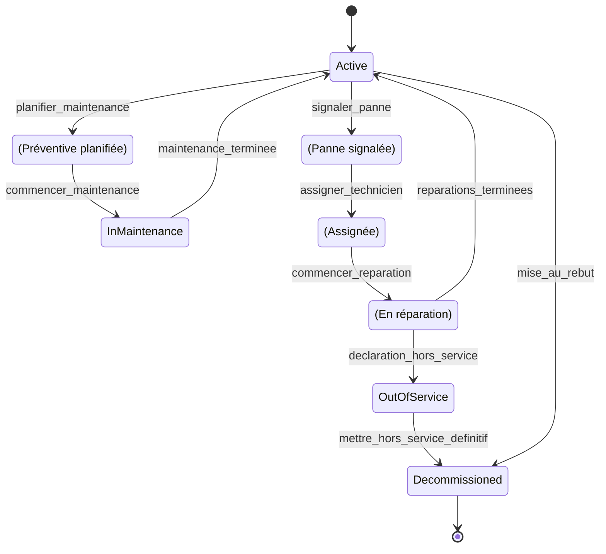
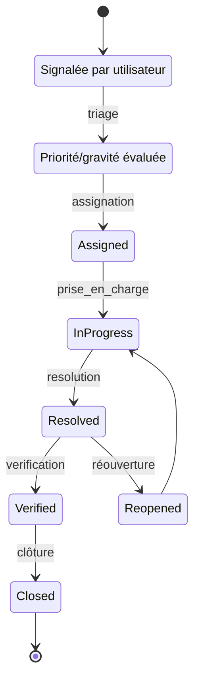
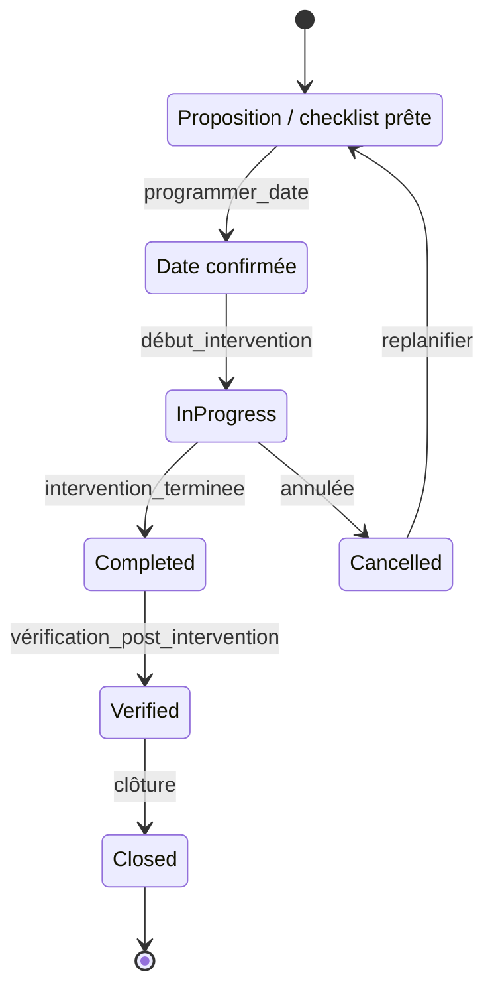

# Diagrammes d'état (State Transition)

Ce fichier contient des diagrammes d'état Mermaid pour les objets principaux : Machine, Panne, Maintenance.

## 1. Machine (MedicalMachine)

## 2. Panne (Incident)

## 3. Maintenance (Ticket)

---

Si vous voulez des versions exportées (SVG/PNG) je peux générer et ajouter les fichiers dans `docs/diagrams/`.